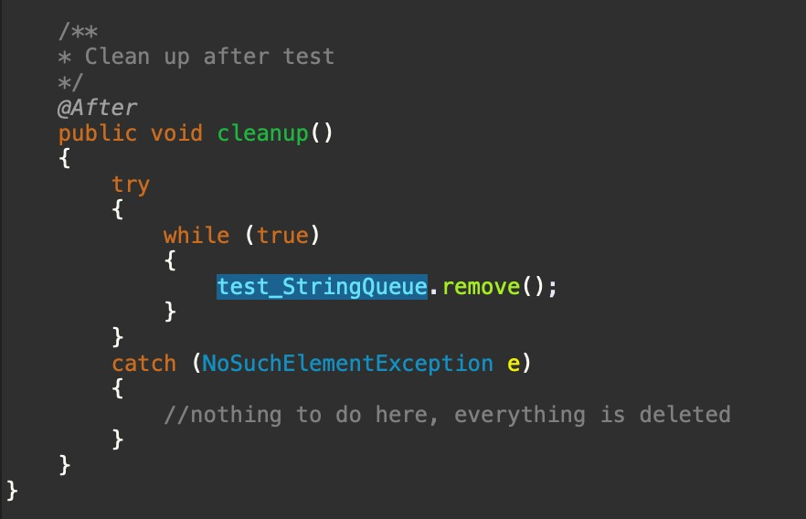

# Software Configuration Management #

# Lab Report #

--------------------------


-----------------------
## Taskliste ##
- [X] Taskliste in Readme einfügen
- [X] Queue Vorlage in das Repository einspielen
- [X] Korrigieren des Source Codes
- [X] Erstellung Klassen- und Methodenkommentare mittels Javadoc
- [X] Erstellung Junit Tests
- [X] Anpassung pom.xml
- [X] Log4j integrieren
- [ ] Maven Size Dokumentation erstellen
- [X] Erstellung Markdown Lab Report
- [X] Vollständigkeit der Abgabe überprüfen
- [X] Abgabe PDF Version


## Bugfixing im Code ##
 
1. String poll() Zeile 34; "== 0"-Abfrage muss auf "!= 0" geändert werden ("> 0" funktioniert auch)
2. String remove(); element bekommt einen Wert von der Poll Methode und wird sofort mit "" überschrieben -> "element = "";" entfernen
3. Konstruktor Übergabeparameter maxsize -> S wird großgeschrieben


## Javadoc Kommentare ##
Mittels /** **/ bzw: /** */ werden Kommentare vor jeder Methode erstellt.
Wir versuchen gute, kurze, aussagekräftige Kommentare zu erstellen.

In Ecliipse gehen wir auf "Project Generate Java-Doc" um die Dokumentation zu generieren.
Dann befindet sich die Doku im "Doc"-Order


JavaDoc Result:


## JUint Tests ##
Erstellt wurden Test für jede Methode, wenn es Daten und und wenn sie keine Daten hat.
Dabei wird jeder Schritt überprüft.
@Before wird ausgeführt, vor dem test und @After nach dem Test


Aufgeräumt sollte auch werden:


Result von den JUnit-Tests:


## pom.xml ##
Anpassung der Developer Informationen in der pom.xml. 
Plugins für Maven Site und Javadoc wurden hinzugefügt.

## Log4j Integration ##
Zuerst wurde ein statischer Logger erstellt welcher in die Konsole schreibt. 
Konfiguriert wurde der Logger in der pom.xml
Eine Info Lognachricht wurde jeder Methode hinzugefügt und ggf um eine Error Lognachricht ergänzt

## Pyhton / Java-Code ##
GitHub-Flavor: 3 zeilen Python Code:
```
print("Existing is pain")
s = "String"
x = 0
```

```
System.out.println("Existing is pain");
String s = "String";
int x = 0;
```


